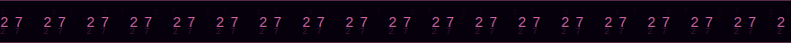
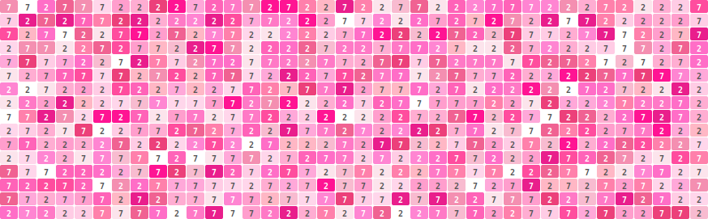

&nbsp;

&nbsp;

 

 

<table border="0" cellspacing="6" cellpadding="0">
<tr>
  <td width="48"></td>
  <td></td>
  <td></td>
  <td></td>
  <td width="48"></td>
  <td width="28"></td>
  <td></td>
  <td></td>
  <td></td>
  <td></td>
  <td></td>
</tr>
<tr>
  <td></td>
  <td width="48"></td>
  <td width="48"></td>
  <td width="48"></td>
  <td></td>
  <td width="28"></td>
  <td width="48"></td>
  <td width="48"></td>
  <td width="48"></td>
  <td width="48"></td>
  <td></td>
</tr>
<tr>
  <td width="48"></td>
  <td width="48"></td>
  <td width="48"></td>
  <td width="48"></td>
  <td></td>
  <td width="28"></td>
  <td width="48"></td>
  <td width="48"></td>
  <td width="48"></td>
  <td></td>
  <td width="48"></td>
</tr>
<tr>
  <td width="48"></td>
  <td width="48"></td>
  <td width="48"></td>
  <td></td>
  <td width="48"></td>
  <td width="28"></td>
  <td width="48"></td>
  <td width="48"></td>
  <td></td>
  <td width="48"></td>
  <td width="48"></td>
</tr>
<tr>
  <td width="48"></td>
  <td width="48"></td>
  <td></td>
  <td width="48"></td>
  <td width="48"></td>
  <td width="28"></td>
  <td width="48"></td>
  <td width="48"></td>
  <td></td>
  <td width="48"></td>
  <td width="48"></td>
</tr>
<tr>
  <td width="48"></td>
  <td></td>
  <td width="48"></td>
  <td width="48"></td>
  <td width="48"></td>
  <td width="28"></td>
  <td width="48"></td>
  <td></td>
  <td width="48"></td>
  <td width="48"></td>
  <td width="48"></td>
</tr>
<tr>
  <td></td>
  <td></td>
  <td></td>
  <td></td>
  <td></td>
  <td width="28"></td>
  <td width="48"></td>
  <td></td>
  <td width="48"></td>
  <td width="48"></td>
  <td width="48"></td>
</tr>
</table>

 

*2727272727272727272727272727*

 

&nbsp;

&nbsp;

&nbsp;

&nbsp;

&nbsp;

&nbsp;

&nbsp;

&nbsp;

 

*🍚 i love chicken rice*

