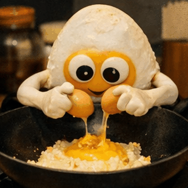
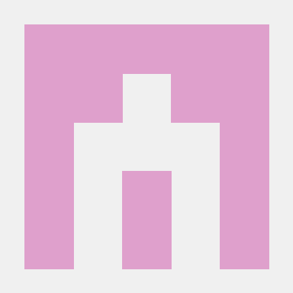

<div align="center">
  <a href="https://github.com/goot27"></a>
  &nbsp;
  <a href="https://twitter.com/goot27"></a>
  &nbsp;
  <a href="https://github.com/WokSpec"></a>
</div>

<div align="center">
  
</div>

## Profile

| Property | Data |
| --- | --- |
| Name | `goot27` |
| Focus | terminal visuals, playful UX, AI-assisted building |
| Main Stack |  |
| Editors | <a href="https://neovim.io"></a> <a href="https://zed.dev"></a> |
| Community | <a href="https://discord.gg/B7Bhuherkn"></a> |

<div align="center">
  <a href="https://discord.gg/B7Bhuherkn">
    
  </a>
  <br/>
  <sub>Join my Discord community: <b>Egg Fried Rice</b></sub>
</div>

## Run It

```bash
# linux · mac · wsl
curl -fsSL https://raw.githubusercontent.com/goot27/goot27/main/run_27.py | python3
```

```powershell
# windows
python -c "import urllib.request as r; exec(r.urlopen('https://raw.githubusercontent.com/goot27/goot27/main/run_27.py').read())"
```

## Sequence

`starfield -> countdown -> shockwave -> ascii reveal -> rings -> flash -> snake game`

<div align="center">
  
</div>

<h1 align="center">🍚 I LOVE CHICKEN RICE 🍗</h1>


