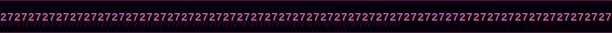

<div align="center">

<a href="https://github.com/goot27"></a>
&nbsp;
<a href="https://twitter.com/27goot"></a>
&nbsp;
<a href="https://github.com/WokSpec"></a>

</div>

<br/>

<div align="center">

</div>

<br/>

<div align="center">

</div>

<br/>

<div align="center">
<table border="0" cellpadding="12" cellspacing="0">
<tr>
<td align="center" valign="top">
<sub><b>&nbsp;EDITOR&nbsp;</b></sub><br/><br/>
<a href="https://neovim.io"></a>&nbsp;
<a href="https://zed.dev"></a>
</td>
<td align="center" valign="top">
<sub><b>&nbsp;MODELS&nbsp;</b></sub><br/><br/>
<a href="https://anthropic.com"></a>&nbsp;
<a href="https://openai.com"></a>&nbsp;
<a href="https://gemini.google.com"></a>&nbsp;
<a href="https://grok.x.ai"></a>
</td>
<td align="center" valign="top">
<sub><b>&nbsp;SEARCH · THINK&nbsp;</b></sub><br/><br/>
<a href="https://perplexity.ai"></a>&nbsp;
<a href="https://notion.so"></a>
</td>
<td align="center" valign="top">
<sub><b>&nbsp;RUN LOCAL&nbsp;</b></sub><br/><br/>
<a href="https://ollama.com"></a>&nbsp;
<a href="https://huggingface.co"></a>&nbsp;
<a href="https://groq.com"></a>
</td>
</tr>
</table>
</div>

<br/>

```bash
# linux · mac · wsl
curl -s https://raw.githubusercontent.com/goot27/goot27/main/run_27.py | python3
```

```powershell
# windows
python -c "import urllib.request as r; exec(r.urlopen('https://raw.githubusercontent.com/goot27/goot27/main/run_27.py').read())"
```
<br/>

<br/>

<table align="center" border="0" cellpadding="10" cellspacing="0">
<tr>
<td align="center" valign="middle">
<a href="https://discord.gg/B7Bhuherkn">
  
</a>
</td>
<td align="left" valign="middle">
<b>Egg Fried Rice</b><br/>
<sub>family • builders • thinkers • artists • good energy</sub><br/><br/>
<a href="https://discord.gg/B7Bhuherkn">
  
</a><br/>
<sub>😼🙀😻😹</sub>
</td>
</tr>
</table>

<br/>


